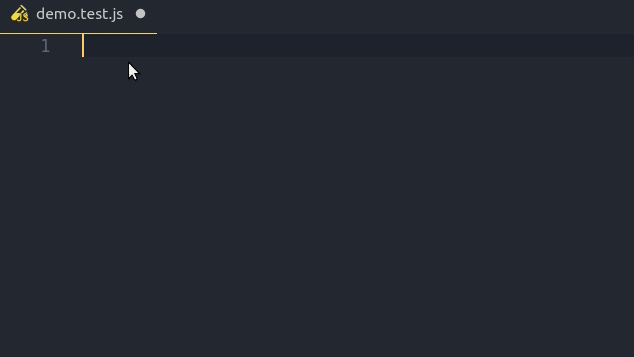

# Simple codeceptjs-snippets

Support your test development by providing snippets for [CodeceptJS](https://codecept.io).



## Snippets

| Snippet | Renders                          |
| ------- | -------------------------------- |
| `fet`   | New Feature
| `nsc`   | New Scenario                     |
| `nsct`  | New Scenario with tags           |
| `bef`   | Before                           |
| `befs`  | Before Suite                     |
| `aft`   | After                            |
| `afts`  | After Suite                      |
| `wit`   | Within                     |

## Full Expansions

### fet - New feature

```javascript
Feature('@Tag: Title');
```

### nsc - New Scenario

```javascript
Scenario('Title', (I) => {
    // add steps here
});
```

### nsct - New Scenario with tags

```javascript
Scenario('Title', (I) => {
    // add steps here
}).tag('@Tags');
```

### bef - Before

```javascript
Before((I) => {
    // add steps here
});
```

### befs - Before Suite

```javascript
BeforeSuite((I) => {
    // add steps here
});
```

### aft - After

```javascript
After((I) => {
    // add steps here
});
```

### afts - After Suite

```javascript
AfterSuite((I) => {
    // add steps here
});
```

### wit - Within

```javascript
within('Selector', () => {
    // add steps here
});
```

**Enjoy!**
